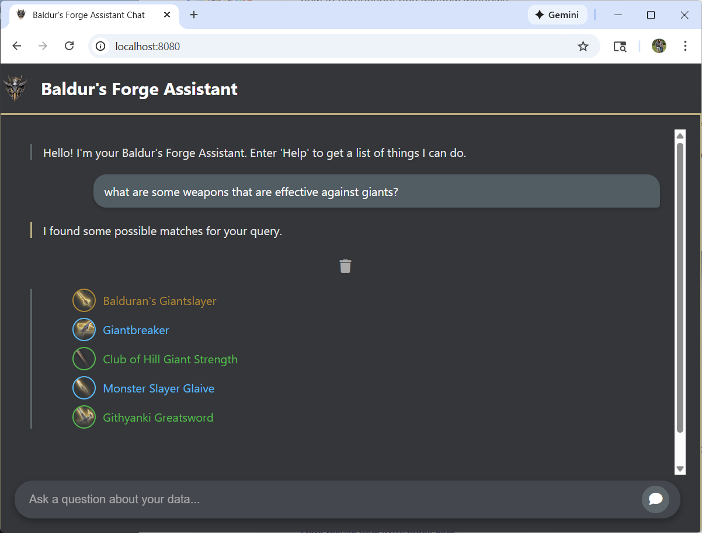
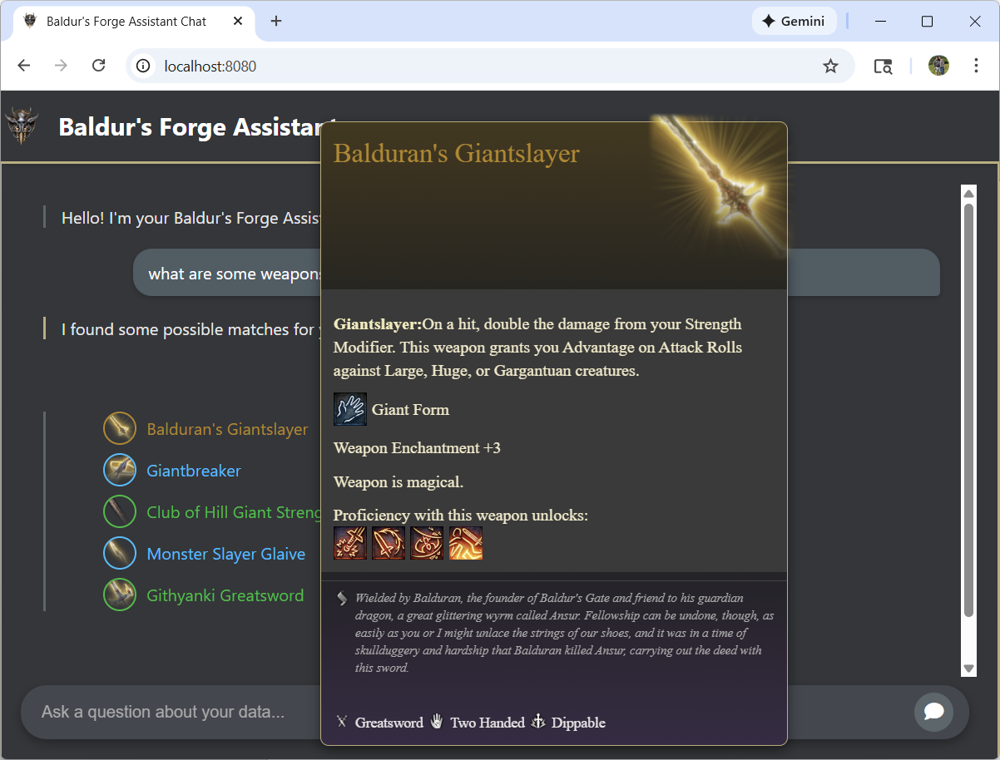

# Quarkus Chat Frames

Quarkus Chat Frames is an extension built on top of [Quarkus Langchain4j](https://docs.quarkiverse.io/quarkus-langchain4j/dev/index.html) to help build chat applications.

* Provide a remote invocation framework for AIServices for clients (mobile and web UIs, REST or Websocket)
* Provide a simple event based API between clients and server
* Provide simpler chat memory management for chat applications that manage interactions with multiple prompts
* Provide a way to define simple flow in a chat application that has multiple prompts
* Provide session capabilities for REST based applications
* Provide chat conversation scoped data
* Provide a way to map AIService results to structures consumable by client (i.e. markdown to html, json to html, etc.)


## Learn by example

Let's learn Quarkus Chat Frames by slowly iterating and building up a full featured chat application.  There will be a 
lot of pseudo code and hand waving in this example, but hopefully you'll get the gist of things.

## The Example App

The example app is a web application that has chat interface.  It's purpose is to design mod addons for
the 2023 Game of the Year, Baldur's Gate 3 (BG3), a Dungeons & Dragons RPG video game.  This is an actual application that I wrote and it is called Baldur's Forge.  It's still a work in
progress, but its fairly functional.  The app currently let's you do natural language queries on the game's magical armor and weapons to find out information about them and to see what their stats are.  It also let's you build new armor and weapons, package it as a mod, and use these new items in game.

Let's go through the evolution of this application to illustrate various concepts of Quarkus Chat Frames.

## Remote Inovcation for an AI Service

When I started Baldur's Forge, I knew very little about [Quarkus Langchain4j](https://docs.quarkiverse.io/quarkus-langchain4j/dev/index.html) and AI in general, but I wanted to create a pure natural language chat interface
for building a BG3 mod.  The first bit of functionality I wrote was the ability to write a natural langauge query for magical items that came with the BG3 game.  Yup!
I needed RAG. I used [Quarkus Langchain4j Easy RAG](https://docs.quarkiverse.io/quarkus-langchain4j/dev/rag-easy-rag.html) to get
a RAG prompt up and running.  It was insanely easy.  

The first thing I had to do was create a text file that described each and every item in my BG3 equipment database.  I stored this in a directory and all I had to do
was point Quarkus to it:

```conf
quarkus.langchain4j.easy-rag.path=/home/bburke/bg3/db/textfiles
```

The next thing to do was to create an AiService, the definition of the prompt that would be used with the LLM:

```java
@RegisterAiService
public interface RagPrompt {

    @SystemMessage("""
            You are a database for magical armor and weapons in a Dungeons and Dragon's game.  Answer questions about these items.
            Your response must be polite, use the same language as the question, and be relevant to the question.

            When you don't know, respond that you don't know the answer.
            """)
    String chat(@UserMessage String question);
}
```

That was it!!

Calling `RagPrompt.chat()` makes a RAG query internally and feeds the results and your question to the LLM and returns a string response.  Quarkus
Easy RAG wired up everything automatically for me.  All this is basic Quarkus Langchain4j.  Let's look at what Chat Frames could help me with!

Now, after I had a working RAG prompt engine, I wanted to wire up my JQuery-based Web client.  I needed a way to invoke on the AiService from my web chat client.  
This is where Chat Frames helps out as it can provide a remote interface for your AI Services.  Here's the server code:

```java
import io.quarkiverse.langchain4j.chat.frames.ChatFrame;

@RegisterAiService
public interface RagPrompt {

    @SystemMessage("""
            You are a database for magical armor and weapons in a Dungeons and Dragon's game.  Answer questions about these items.
            Your response must be polite, use the same language as the question, and be relevant to the question.

            When you don't know, respond that you don't know the answer.
            """)
    @ChatFrame("dnd-db")
    String chat(@UserMessage String question);
}
```

Just annotating `RagPrompt.chat()` with `@ChatFrame` makes it remotely invokable.  Quarkus Chat Frames automatically starts an HTTP endpoint that can receive
JSON messages sent with an HTTP POST (Rest), or via a Web Socket Channel.  By default he URL path for this is `/q/chat-frames` + the name of the chat frame.  So, in this case
the path is `/q/chat-frames/dnd-db`.  

For clients, the initial JSON Message to the server is simple:

```json
{
    "userMessage": "What are some weapons that are effective against giants?"
}
```

Here's how the JavaScript client looks:

```javascript
    let chatContext = null;  // more on this variable later!!

    async function sendChat(message) {
        try {
            let postData = null;
            let request = {
                userMessage: message,
                context: chatContext
            }
            postData = JSON.stringify(request);

            const response = await $.ajax({
            url: `/q/chat-frames/dnd-db`,
                        type: 'POST',
                        data: postData,
                        processData: false,
                        contentType: false
            });
```

The JSON message sent by the JavaScript is sent to the server and the `RagPrompt.chat()` method is invoked based on that JSON payload.
The AiService executes and a response JSON document is sent back to the chat frame client with the following format:

```json
{
    "events": [
                {"type": "eventType" , "value" : ...anything...}..
              ],
    "context": {...}
}
```

The *"events"* field contains a list of event objects.  *"type"* is the kind of event.  The *"value"* can be anything (primitive, string, or another json object).
The *"context"* field is only sent back with Rest invocations.  This is an opaque field that contains chat conversation state and should be resent back to the server on future chat requests.

For our chat example, Quarkus Chat Frames automatically converts the String response from the `RagPrompt.chat()` method to a *StringMessage* event type:

```json
{
    "events": [ 
        {"type": "StringMessage", "value": "There are a number of weaponst that can help fight dragons..."}
    ],
    "context": {...}
}
```

The finished Javascript client looks like this:

```javascript
    let chatContext = null;  // more on this variable later!!

    async function sendChat(message) {
        try {
            let postData = null;
            let request = {
                userMessage: message,
                context: chatContext
            }
            postData = JSON.stringify(request);

            const response = await $.ajax({
            url: `/q/chat-frames/dnd-db`,
                        type: 'POST',
                        data: postData,
                        processData: false,
                        contentType: false
            });
            // Don't forget to save the context for use in the next conversational chat call!
            chatContext = response.context;

            if (response.events) {
                for (const event of response.events) {
                    if (event.type === 'StringMessage') {
                        handleStringMessage(event.value);
                    }
                }
            }
```

The client just loops through the events returned by the server and calls a handle method based on the type.  We'll see later how you can send your own
application specific event types back to the client.

Notice also that the global variable `chatContext` is set with the response's *"context"* field.  This context data must be passed with the next chat request.  It keeps conversational state for Rest clients.

*TODO: Give a Web Socket example*

## Securing Chat Frames

The endpoint for chat frames is a non-application-based URL path.  You can secure chat frame endpoints by using built in Quarkus http security features and annotations.  Here's an example
of setting up basic auth and adding role-based security.  First set up `application.properties`:

```conf
quarkus.http.auth.basic=true
quarkus.http.auth.permission.roles1.paths=/q/chat-frames
quarkus.http.auth.permission.roles1.policy=authenticated
```

This is just basic [Quarkus HTTP Security](https://quarkus.io/guides/security-basic-authentication).  In the file above, we are turning on basic authentication and saying that we want the chat frames endpoint and subpaths to require
authentication.  How you set up users and role mappings depends on how you set up Quarkus security.  We won't go into that as its just basic Quarkus.

Security annotations like `@RolesAllowed` can be used on `@ChatFrame` methods:

```java
import io.quarkiverse.langchain4j.chat.frames.ChatFrame;
import jakarta.annotation.security.RolesAllowed;

@RegisterAiService
public interface RagPrompt {

    @SystemMessage("""
            You are a database for magical armor and weapons in a Dungeons and Dragon's game.  Answer questions about these items.
            Your response must be polite, use the same language as the question, and be relevant to the question.

            When you don't know, respond that you don't know the answer.
            """)
    @ChatFrame("dnd-db")
    @RolesAllowed("user")
    String chat(@UserMessage String question);
}
```

## Decoupling Chat Frames from AI Services

Sometimes we may not want our UI client interacting directly with an Ai Service.  You do not have to use `@ChatFrame` with an Ai Service.
You can write bean classes and annotation methods with `@ChatFrame` so that these methods can be invoked in the same way as previous examples.


```java
@ApplicationScoped
public class PromptProcessor {
    @Inject
    RagPrompt prompt;

    @ChatFrame("dnd-db")
    String wrapIt(@UserMessage msg) {
        // Do some preprocessing
        String chatMsg = prompt.chat(msg);
        // Do some post processing 
        chatMsg = markdown2html(chatMsg);
        return chatMsg;
    }
}
```

## Sending back multiple events via ChatFrameContext

So, in the RAG example above for my BG3 application, the UI was a little boring and not that helpful.  Sure it could
answer questions about BG3 armor and weapons, but it would only give summary answers.  I wanted it to actually render something
nice for each armor or weapon it found, then give a summary.  I had access game icons and a structured database for each entry.
It made sense for the LLM to find these items and give a summary and give answers to my questions, but it didn't make sense for the LLM
to render the items found.  Rendering would just be classic client-server-CRUD.  But how to mix the two together?

The first thing I did had nothing to do with chat frames.  I had to ditch Easy RAG and do
embedding queries directly. I had to associate metadata with each embedding so that I could pull the ID of the items the LLM found so I could
get a data structure from the DB representing those items.  Once I had a list of objects, I could send those items back to the UI client to be rendered
along with the answer to the question the LLM provided.  The AiService prompt had to change a little but, but I won't get into that.  Here's some
pseudo code to illustrate what I'm talking about:

```java
@ApplicationScoped
public class RagAgent {
    @Inject
    RagPrompt prompt;

    @Inject
    GameEquipmentDB db;

    @Inject
    EmbeddingStore<TextSegment> embeddingStore;

    @Inject
    EmbeddingModel embeddingModel;

    @ChatFrame("dnd-db")
    public String query(@UserMessage userMsg, ChatFrameContext ctx) {
 

        EmbeddingSearchResult<TextSegment> search = embeddingStore.search(
            request(userMsg)
        );

        List<Equipment> relatedItems = search.matches().stream().map(m -> {
            String id = m.embedded().metadata().getString("id");
            return db.get(id);
        }).toList();

        ctx.addEvent("EquipmentList", relatedItems); 

        String llmSummary = prompt.chat(userMsg, relatedItems);
        return llmSummary;
    }

    private EmbeddingSearchRequest request(String userMessage) {
        Embedding embedding = embeddingModel.embed(queryString).content();
        EmbeddingSearchRequest request = EmbeddingSearchRequest.builder()
                .queryEmbedding(embedding)
                .minScore(0.75)
                .maxResults(5)
                .build();
        return request;
    }
}
```
If you look at the `query()` method you see that it is a `@ChatFrame`.  It's parameters are the user message and a `ChatFrameContext`.
The `ChatFrameContext` is utility interface for Quarkus Chat Frames.  For this example, we'll use it to piggyback an additional event
back to the client.

Here is what our Java code is doing:


1. First, a search request is created using the user message and the embedding model.
2. Next, the search is executed on the embedding store of the BG3 equipment DB.  This returns a set of `TextSegments` with metadata associated with it.
3. The matches are iterated upon.  Each embedding has ID metadata associated with it.  This ID is used to query the BG3 database to get the DAO of the item.
4. Now that we have the list of equipment, that list is sent back as an event to the client by calling `ctx.addEvent()`.  The client uses this event to create a nice rendering of each item found.
5. The user message and list of related equipment is sent to the AiService prompt so that the user message query can be answered
6. We return the answer the LLM found too.  (This creates an additional event).

Here is the JSON sent back to the client:
```json
{
    "events": [
        {"type": "ListEquipment", "value": [...]},
        {"type": "StringMessage", "There are a number of weapons that can help fighting giants..."}
    ],
    "context": {...}
}
```

Our web client needs to change to support handling the *ListEquipment* event type.

```javascript
    async function sendChat(message) {
        try {
            let postData = null;
            let request = {
                userMessage: message,
                context: chatContext
            }
            postData = JSON.stringify(request);

            const response = await $.ajax({
            url: `/q/chat-frames/dnd-db`,
                        type: 'POST',
                        data: postData,
                        processData: false,
                        contentType: false
            });
            chatContext = response.context;
            if (response.events) {
                for (const event of response.events) {
                    if (event.type === 'StringMessage') {
                        handleStringMessage(event.value);
                    } else if (event.type === 'ListEquipment') {
                        renderEquipmentList(event.value);
                    }
                }
            }
```

Here's what it looks like in the UI:



If you mouse over a listed item, it pops up a detailed tooltip of the listed item.  



All this nice rendering is done solely via custom app developer code using JQuery and the list
of equipment extract from the embedding search request we did with the LLM..  We have successfully mixed traditional CRUD UI techniques with the LLM!

FYI: In the final implementation I actually decided I didn't care at all about LLM answers to the user message query.  All I cared about was the list of related
items to my user request.  The LLM response was often inconsistent, irrelevant, and even weird or wrong.  All things you DO NOT WANT in a good UI! So, I removed the
last interaction with the LLM to get a summary and only used the LLM for creating a search embedding.

The final implementation of this RAG query was part of a larger application that I'll dive into later when we talk about other Chat Frame features, but the
code that invokes the rag request is [here](https://github.com/patriot1burke/baldurs-forge/blob/main/armory/src/main/java/org/baldurs/forge/mainmenu/MainMenuToolBox.java#L70), the implementation of the request is [here](https://github.com/patriot1burke/baldurs-forge/blob/main/armory/src/main/java/org/baldurs/forge/services/EquipmentDB.java#L256), and the UI code is [here](https://github.com/patriot1burke/baldurs-forge/blob/main/armory/src/main/resources/META-INF/resources/index.html#L1274).  

## Chat Memory Management and the Chat Frame Stack

I've written a [blog about how chat memory works](https://bill.burkecentral.com/2025/11/25/managing-chat-memory-in-quarkus-langchain4j/) with Quarkus Langchain4j.  Chat Frames expands on this chat memory management.  Chat Frames work best when you use default memory ids.  In other words:  when you do *NOT* use `@MemoryId` in your AI Service methods.  For default memory ids, Chat Frames sets the default memory id to be the chat frame *context path* + `#` + *fully qualified interface name* + `.` + *method name*.  So for this AI Service:

```java
import io.quarkiverse.langchain4j.chat.frames.ChatFrame;

@RegisterAiService
public interface RagPrompt {

    @ChatFrame("dnd-db")
    String chat(@UserMessage String question);
}
```

The default memory id for the `chat()` method would be `/dnd-db#RagPrompt.chat`.  Why is that distinction important?  Chat Frames allows you to change the current
`@ChatFrame` your client is talking to by programmatically pushing and popping it from a chat frame stack.  Consider this code:

```java

public class Menu {
    @Inject
    RagPromopt rag;

    @ChatFrame("menu")
    public String chat(@UserMessage msg, ChatFrameContext ctx) {
        ctx.pushFrame("dnd-db");
        return rag.chat(msg);
    }
}
```

The `ChatFrameContext.pushFrame()` method call in the above code does a few things:
1. Any chat memory entries starting with `/menu#` are cleared.
2. Future posts from the client are now routed to the `dnd-db` chat frame
3. The default chat memory id prefix becomes `/menu/dnd-db`.

There's also a method `ChatFrameContext.popFrame()`.  If this is invoked after the above scenario
1. Any chat memory entries starting with `/menu/dnd-db#` are wiped and cleared.
2. Future posts from the client are now routed to the `menu` chat frame
3. The default chat memory id prefix is now `/menu` again.

As we'll see in the next chapter, this allows you to have nested chat conversations between the client and server and
to easily manage chat memory

## Nested Conversations

As my BG3 chat application evolved I wanted to add the ability to not only search for current equipment in the game,
but to also be able to create new equipment.  Creating new equipment required a new chat dialogue with the user.
Each type of equipment required a little bit different data input to create.
The LLM started to get really confused when I tried to do so many different things within one prompt, so I broke things out into
multiple AI Services (one for each equipment type, i.e. armor, ring, weapon, boots, gloves, cloak, etc.) and wrote what I call a *Main Menu* prompt
that took a user message query and routed it to a prompt that handled what the user wanted to do.

### Main Menu Prompt and tools

The *Main Menu* prompt worked by telling the LLM to invoke a specific tool method based on the user message posted to the prompt.

```java
@SessionScoped
@RegisterAiService
public interface MainMenuPrompt {

    @SystemMessage(fromResource = "prompts/mainMenuCommands.txt")
    @ToolBox({ MainMenuToolBox.class })
    @ChatFrame("mainMenu")
    String chat(@UserMessage String message);
}```

The prompt says something like this:

```
If the user is searching for some equipment, then call the search tool.  
If the user wants to create a weapon call the createWeapon tool
```

Here is the [full prompt](https://github.com/patriot1burke/baldurs-forge/blob/main/armory/src/main/resources/prompts/mainMenuCommands.txt).

The `MainMenuToolBox` contains all the tool methods for the *Main Menu* prompt.

### Create Weapon needs its own chat conversation (pushFrame)

As I said earlier, creating an item requires a specific chat dialogue with the LLM as there is a little bit of generative AI going on as well 
as a bunch of data input that is needed from the user.  When a user first interacts with our chat application, the *Main Menu* chat frame
is called.  If the user wants to create an item, they might type something like this *Create me a +3 legendary longsword*.  The *Main Menu*
chat frame runs this query through the *Main Menu* prompt and the LLM will invoke the `createNewWeapon` tool.

```java
@SessionScoped
public class MainMenuToolBox {
    @Inject
    WeaponBuilderPrompt weapon;

    @Inject
    ChatFrameContext ctx;

    @Tool("Create a new weapon")
    public String createWeapon() {
        ctx.pushFrame("weapon");
        return weapon.chat(ctx.userMessage());

    }
}
```

The `createWeapon()` tool method uses the `ChatFrameContext` to push a new chat conversation on the conversation stack: creating a new weapon.
We then invoke the `WeaponBuilderPrompt.chat()` method with the current user message to start the dialogue.  Calling `ChatFrameContext.pushFrame()` clears all
chat memory referenced in the *Main Menu* chat frame conversation and sets a new default memory prefix to be `/mainmenu/weapon`.  Any
user messages the client posts to the server will now be routed to the `weapon` chat frame.

Originally, `createWeapon()` had a `String` parameter for the creation query extracted from the user message.  What I found was that the LLM
was very unreliable on what was put in that parameter.  This is why we need the original full user message which can be obtained from `ChatFrameContext.userMessage()`.
The weapon builder will be very interested in the *+3 legendary longsword* text and we want to make sure it gets it!

### Create weapon chat needs to build a document: Chat Frame Context Data

The weapon builder chat dialogue needs a bunch of information from the user before it can complete it.  Originally I relied on chat memory
to hold on the information gathered before the item finished.  While this usually worked, it was not 100%, and sometimes the LLM got confused
and left out inputed data in the final product.  To make this more reliable I had a set of tool methods that were invoked by the weapon builder
prompt and they would store the weapon object directly in memory through Chat Frame Data.

```java
@ApplicationScope
public class WeaponBuilderToolbox {
    @Inject
    ChatFrameContext ctx;

    @Tool("Set the name of the weapon")
    public void setName(String name) {
        WeaponModel weapon = ctx.getData("current", WewaponModel.class);
        if (weapon == null) {
            weapon = new WeaponModel();
            ctx.setData("current", weapon);
        }
        weapon.setName(name);
    }
}
```

The `ChatFrameContext.getData()` and `ChatFrameContext.setData()` methods allow you to interact with chat frame data.  It is important to note that
for REST chat frame sessions, this data is marshalled to json and set back to the client.  REST conversations are server-side stateless and the client
will hold all session data.  This means that any data must be marshallable to JSON.  Use Jackson annotations if you want to fine tune this.

Another thing to note is that chat context data is associated with the current chat frame.  When the current chat framed is popped by callling
`ChatFrameContext.popFrame()` all the context data associated with the current chat frame will be released.  This gives you a nice way
of cleaning up after your dialogue is complete.

### Finish the weapon and go back to main menu (popFrame)

The user is told that when they are done defining their new weapon that they should say that they are finished.  In our implementation
this routes to the `finishEquipment()` tool method.

```java
@ApplicationScope
public class WeaponBuilderToolbox {
    @Inject
    ChatFrameContext ctx;

    @Tool("Set the name of the weapon")
    public void finishEquipment() {
        WeaponModel weapon = ctx.getData("current", WewaponModel.class);
        popFrame(); // cleans up chat memory and chat frame data for weapon chat

        // we are now back to the main menu chat frame
        NewModModel newEquipment = context.getData(NewModModel.NEW_EQUIPMENT, NewModModel.class);
        if (newEquipment == null) {
            newEquipment = new NewModModel();
            context.setData(NewModModel.NEW_EQUIPMENT, newEquipment);
        }
        newEquipment.addEquipment(current);
        context.addEvent("Finished building item!  Tell me to package up your new mod when you are ready.");        
    }
}
```

Here we get the built weapon from context data.  Pop the chat frame stack back to the *Main Menu* chat frame.  This cleans up chat memory and chat frame data from
the weapon builder conversation.  From the *Main Menu* chat frame data we get the `NewModModel` object and add the newly created weapon to it.
Packaging up our new mod so that it can be run within BG3 is a different *Main Menu* command that uses this object.

## @FrameInject

## @EventType

## @EventMapper

## Other ChatFrameContext methods

### Schedule a chat memory wipe

### Invoking a chat frame dynamically

## Java Client 


